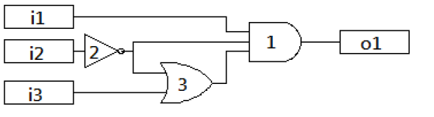
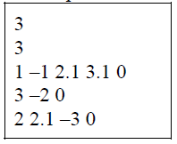
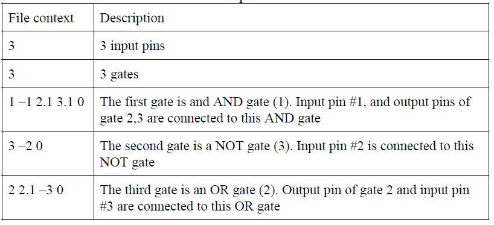

# Logic simulation
## 1. Text-mode interface
	1. Load logic circuit file
	2. Simulation
	3. Display truth table
	4. Exit
	Command:
## 2. User scenario of LS
	1. Load logic circuit file
	2. Simulation
	3. Display truth table
	4. Exit
	Command:1
	Please key in a file path: C:\LS\file_not_exist_or_format_error.lcf
	File not found or file format error!!
	
	1. Load logic circuit file
	2. Simulation
	3. Display truth table
	4. Exit
	Command:2
	Please load an lcf file, before using this operation.
	
	1. Load logic circuit file
	2. Simulation
	3. Display truth table
	4. Exit
	Command:1
	Please key in a file path: C:\LS\file1.lcf
	Circuit: 3 input pins, 1 output pins and 3 gates
	
	1. Load logic circuit file
	2. Simulation
	3. Display truth table
	4. Exit
	Command:2
	Please key in the value of input pin 1: -1
	The value of input pin must be 0/1
	Please key in the value of input pin 1: 0
	Please key in the value of input pin 2: 1
	Please key in the value of input pin 3: 1
	Simulation Result:
	i i i | o
	1 2 3 | 1
	------+--
	0 1 1 | 0
	
	1. Load logic circuit file
	2. Simulation
	3. Display truth table
	4. Exit
	Command:3
	Truth table:
	i i i | o
	1 2 3 | 1
	------+--
	0 0 0 | 0
	0 0 1 | 0
	0 1 0 | 0
	0 1 1 | 0
	1 0 0 | 1
	1 0 1 | 1
	1 1 0 | 0
	1 1 1 | 0
	
	1. Load logic circuit file
	2. Simulation
	3. Display truth table
	4. Exit
	Command:4
	Goodbye, thanks for using LS.
## 3. Logic circuit file
Each logic circuit description will first contain an integer NI (0 < NI <= 16) followed by another integer NG (0 < NG <= 1000), where NI is the number of input pins of the circuit and NG is the number of gates of the circuit. The input pins are numbered from 1..NI and the gates are numbered from 1..NG. Next, for each gate x (in increasing numerical order), there will appear a list of numbers terminated by zero. Each gate x has a single output pin and a number of input pins. Each list describes the gate type of x and the connections of the input pins of x. The first integer of the list denotes the gate type (1: AND, 2: OR, 3: NOT) of x. The other numbers of the list describe connections, representing the pin number of the connected input pin. A positive number i.j indicates
that (the output pin j of) the gate i is connected to (the input pin of) gate x. A negative number n, on the other hand, indicates that the input pin –n of the circuit is connected to (the input pin) of gate x. For example, the meaning of “1 -2 4.3 0” is an AND gate, and its first input is connected to input pin #2 and its second input is connected to the third output pin of gate 4. For simplicity, you may assume the input circuits are always legal circuits, and all logic gates have only one output in this project (i.e. the decimal places are always 1). Table 1 is a sample file (File1.lcf) of logic circuit file. The corresponding description and logic circuit are shown in Table 2 and Figure 1.

Figure 1 Logic circuit of File1.lcf 
 
Table 1 Sample file – File1.lcf  

Table 2 Description of File1.lcf  

